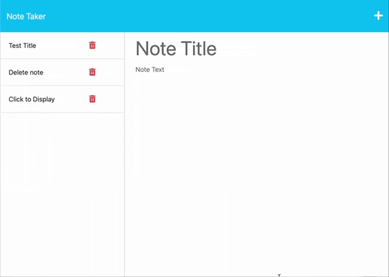

# 📝 Note Taker (Express.js)
Write and organize your notes with ease!

## 🌟 Description
An application designed to help small business owners write, save, and organize their notes. This project utilizes Express.js to power its back end, leveraging JSON files to store and retrieve notes.

) 

## 📜 User Story
AS A small business owner 
I WANT to be able to write and save notes 
SO THAT I can organize my thoughts and keep track of tasks I need to complete 

## ✨ Features
📄 Landing page with a link to the notes page. 
📋 List of existing notes and fields to create new notes. 
🖋 Ability to view, save, and (optionally) delete notes. 

## 🚀 Installation
1. Clone the repository.
2. Navigate to the directory and run npm install.
3. To start the server, run node server.js.
(if you have npm installed run npm start)
4. Visit localhost:3001 in your browser to access the application.

## 🔗 API Routes
GET /notes - Returns the notes.html page. 
GET * - Returns the index.html page. 
GET /api/notes - Returns all saved notes as JSON. 
POST /api/notes - Accepts a new note, saves it, and returns the saved note. 
DELETE /api/notes/:id (Bonus) - Deletes a note with a specific ID. 

## 🌍 Deployment

[Note Taker](https://note-taker-1010-f0d2b7ee2090.herokuapp.com/)

## 🤝 Contribution
-Tutor Andres Jimenez
-
## 📄 License
This project is MIT licensed.

## 👏 Acknowledgements
edX Boot Camps LLC for the project prompt and resources.

